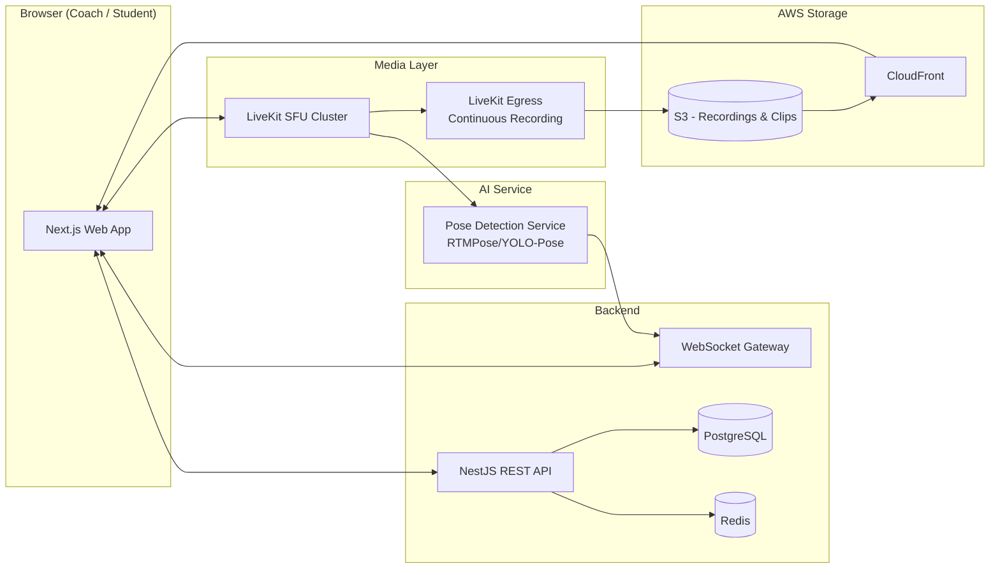

# 00 — Project Overview

## 1. Product Name (working title)

**ReplayCoach** — a live remote-coaching platform with instant DVR-style replay and AI-assisted skeleton overlay, purpose-built for movement-based coaching (pole fitness, dance, gymnastics, physical therapy, sports form review).

## 2. One-Sentence Description

A custom video-call platform (not Zoom) where a coach can, at any moment, rewind and replay any part of the live session, draw on the paused frame, overlay a body-skeleton on a student, and choose exactly which student(s) see the replay — without interrupting the live class.

## 3. Problem Statement

Verbal feedback ("your shoulder dropped") fails in remote coaching because the student cannot see what the coach saw. Existing video-call tools (Zoom, Meet, Teams) have no rewind, no drawing tools, and no body tracking. Coaches currently work around this with screen recording + a separate video player, which is slow, breaks flow, and cannot be shown live to a specific student mid-class.

## 4. Product Pillars

| Pillar | Description |
|---|---|
| **Live video** | Custom-built video calling (not a Zoom integration — see §6 and `07_LiveKit_Video_Architecture.md` for why) |
| **Full-session DVR** | The entire session is recorded and seekable, not just a short rolling buffer |
| **Skeleton overlay** | Real-time pose estimation drawn on both the live feed and the replay |
| **Annotation** | Coach draws circles, arrows, freehand, and text on a paused replay frame |
| **Targeted replay** | In group sessions, the coach chooses which student(s) see a given replay — others keep watching live |

## 5. Primary Personas

| Persona | Needs |
|---|---|
| **Coach (Instructor)** | Runs the session, controls recording/replay/annotation, picks who sees a replay, reviews sessions afterward |
| **Student (Participant)** | Joins a session, performs movements, receives targeted replay + annotated feedback, can review their own past sessions |
| **Studio Admin** (org-level, if the platform is sold to studios, not just individual coaches) | Manages coaches, students, billing seats, session history across the org |

> **Assumption A1:** A studio/org tier is included in the data model (see `05_Database_Design.md`) even though it wasn't explicitly requested, because "thousands of users" strongly implies a B2B2C sales motion (studios buying seats for their coaches) rather than pure B2C. This is cheap to model now and expensive to retrofit later. If the client confirms individual-coach-only, this can be simplified.

## 6. Resolved Architectural Decisions (from discovery conversation)

These three decisions were explicitly confirmed by the client-facing stakeholder and now anchor the entire design. Every downstream module is built consistently with these.

| Decision | Resolution | Rationale |
|---|---|---|
| **Replay scope** | Full-session DVR — the coach can seek to *any* point in the session, not just the last N seconds | Requires continuous server-side recording (via LiveKit Egress) + object storage + a seekable player, not an in-memory ring buffer. This is a fundamentally different (and heavier) system than a rolling buffer — see `08_Recording_Replay_DVR_System.md` |
| **Video call provider** | Custom-built video room using **LiveKit** (self-hosted or LiveKit Cloud), not real Zoom SDK integration | Zoom's SDK does not expose raw per-participant frames in a way that supports server-side continuous recording + real-time pose inference + targeted per-student replay. Building on LiveKit gives full control over media routing, recording, and track-level access needed for pose detection. The product is *conceptually* "a Zoom for coaches" but is technically an independent video platform. |
| **Replay targeting** | Coach-controlled, per-student | Confirms this is a **multi-participant (group class) capable** platform from day one, not strictly 1:1. The coach can select one or more students to receive a replay while others continue watching the live feed uninterrupted. |

## 7. What This Product Is NOT (explicitly out of scope for AI)

- The AI does **not** coach, score, judge, or give feedback. It only detects and draws body joints (pose estimation).
- No LLM/chatbot feedback generation in v1.
- No automatic form-correction or injury-risk scoring in v1 (may be a v2 roadmap item — see `22_Project_Roadmap.md`).
- No real Zoom/Meet/Teams integration — this is a standalone platform.

## 8. Assumptions Requiring Client Confirmation

These were not resolved in discovery and are given reasonable, clearly-labeled defaults throughout this SDD. Each is flagged again in its relevant module.

| # | Open item | Default assumed in this SDD |
|---|---|---|
| A2 | Concurrent live session scale target | Design supports low hundreds of concurrent sessions at launch, horizontally scalable via LiveKit SFU clustering |
| A3 | Pose-inference budget (GPU cost per session) | Use a CPU/GPU-hybrid model (RTMPose) chosen for the best accuracy-per-dollar at moderate scale — see `09_Pose_Detection_Service.md` |
| A4 | Platform targets | Responsive web app only in v1 (desktop + mobile browser); no native app |
| A5 | Data residency / privacy regime | General GDPR/CCPA-style controls included; no jurisdiction-specific legal review performed (biometric/pose data treated as sensitive by default) |
| A6 | Billing/payments | Out of scope for this SDD; data model leaves clean extension points (Stripe-ready `subscriptions` table) |
| A7 | Clip/recording retention period | Default: recordings retained 90 days, then auto-archived to cold storage, configurable per org |

## 9. High-Level System Summary

## 10. Document Index

This SDD is split into the following files. Read them in this order for full context, or jump directly to the module you need.

| File | Covers |
|---|---|
| `00_Project_Overview.md` | This file |
| `01_Functional_Requirements.md` | Feature-level requirements |
| `02_Non_Functional_Requirements.md` | Performance, scale, availability, compliance targets |
| `03_System_Architecture.md` | Full system architecture and component boundaries |
| `04_Tech_Stack.md` | Technology choices with justification |
| `05_Database_Design.md` | Schema, ERD, indexing strategy |
| `06_Authentication_Authorization_RBAC.md` | Auth, JWT, roles, session security |
| `07_LiveKit_Video_Architecture.md` | Live video room design |
| `08_Recording_Replay_DVR_System.md` | Full-session recording + seekable replay engine |
| `09_Pose_Detection_Service.md` | Real-time skeleton tracking |
| `10_Annotation_System.md` | Drawing/annotation engine |
| `11_WebSocket_Realtime_Architecture.md` | Realtime event system tying it all together |
| `12_Backend_API_Design.md` | REST API contracts |
| `13_Frontend_Architecture.md` | Frontend structure and state management |
| `14_File_Storage_Media_Pipeline.md` | S3/CloudFront media pipeline |
| `15_AWS_Infrastructure.md` | Infrastructure-as-code, networking, ECS/Fargate |
| `16_Security_Guidelines.md` | Cross-cutting security requirements |
| `17_Logging_Monitoring_Observability.md` | Logging, metrics, tracing, alerting |
| `18_Testing_Strategy.md` | Unit/integration/e2e/load testing |
| `19_CI_CD_Deployment.md` | Pipelines and deployment strategy |
| `20_Performance_Optimization.md` | Latency and throughput targets/techniques |
| `21_Production_Checklist.md` | Go-live checklist |
| `22_Project_Roadmap.md` | Build order and phased roadmap |
| `23_Antigravity_Prompt_Library.md` | Module-by-module AI coding prompts |
