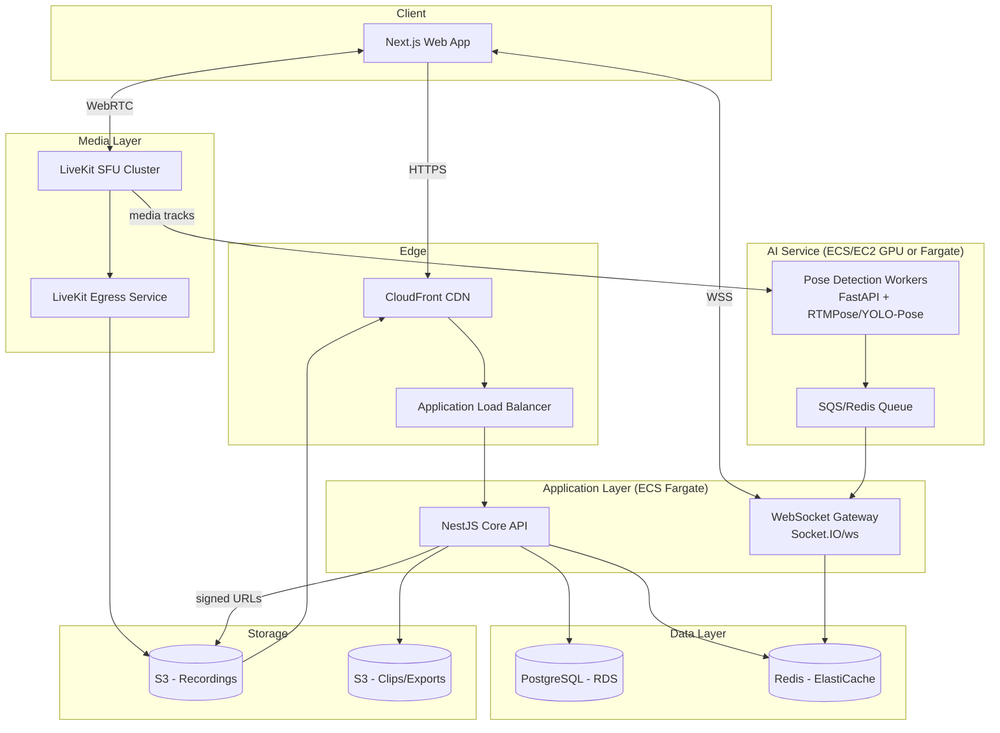
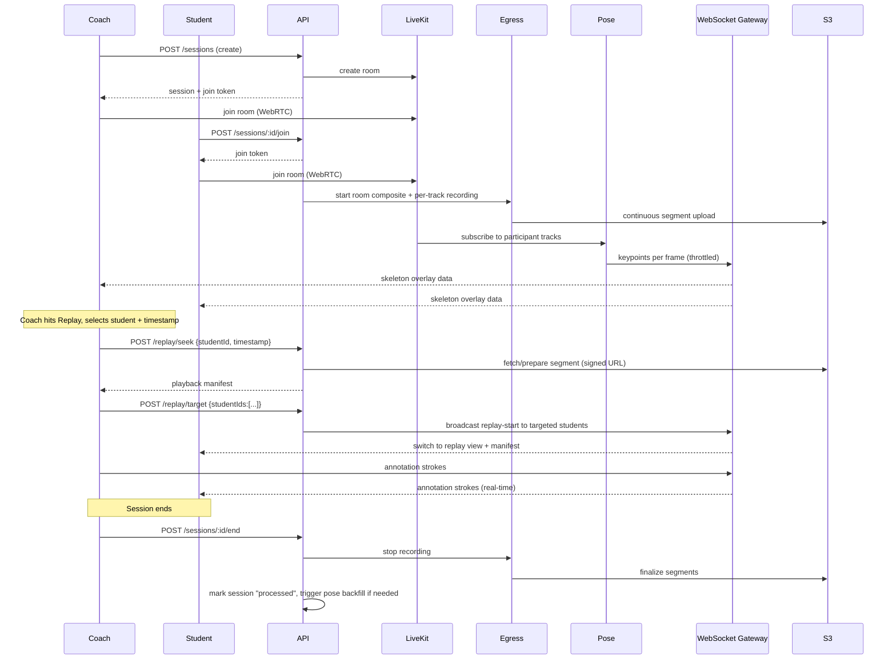

# 03 — System Architecture

## 1. Architectural Style

**Modular monolith backend + specialized real-time services**, not full microservices. Rationale: at the target scale (thousands of users, low-thousands of concurrent sessions), full microservices add operational overhead without payoff. Instead, we cleanly separate services **only where their scaling/runtime characteristics genuinely differ**:

| Service | Why it's separate |
|---|---|
| Core API (NestJS) | Standard CRUD/business logic, scales on request volume |
| WebSocket Gateway | Long-lived connections, scales on concurrent-connection count, not request rate |
| Pose Detection Service (Python/FastAPI) | GPU/CPU-bound ML workload, scales on inference throughput, written in Python for the ML ecosystem |
| LiveKit Media Cluster | WebRTC SFU, scales on bandwidth/participant count — this is infrastructure, not application code |
| Recording/Egress Pipeline | I/O-bound, scales on concurrent recording streams |

Everything else (auth, sessions, users, clips, annotations metadata) lives in the core API as clean, modular domains — not scattered microservices.

## 2. Component Diagram

## 3. Core Domains (Backend Module Boundaries)

Each domain is an isolated NestJS module with its own controller/service/repository, communicating with others only through defined interfaces — never reaching into another domain's database tables directly.

| Domain | Responsibility |
|---|---|
| `auth` | Registration, login, JWT issuance/refresh, OAuth |
| `users` | Profiles, roles |
| `organizations` | Studio/org, coach membership, seats |
| `sessions` | Session lifecycle, participants, join tokens |
| `media` | LiveKit room provisioning, Egress orchestration |
| `pose` | Pose-job orchestration, keypoint storage/retrieval |
| `replay` | Seek requests, replay-targeting logic |
| `annotations` | Annotation CRUD, real-time broadcast coordination |
| `clips` | Saved clip creation, storage linkage |
| `notifications` | Email/in-app notifications |
| `audit` | Security/audit event logging |

## 4. Data Flow: End-to-End Session Lifecycle

## 5. Why Not a Simple Rolling Buffer (Design Justification)

The client's original mental model ("only last 10 seconds, like a security camera") is the *simpler* design, but the confirmed requirement is full-session seekability. This has real architectural consequences documented here so no downstream module quietly reverts to the simpler model:

- **Recording must start at session start and run continuously**, not be triggered on-demand by a "replay" button press.
- **Storage, not memory, is the source of truth** for replay. LiveKit Egress writes segmented recordings (HLS-style chunks) to S3 as the session runs; the replay UI seeks into these chunks via signed CloudFront URLs, not into an in-process buffer.
- Pose keypoints must be **persisted alongside timestamps**, not just computed transiently, so that scrubbing to an arbitrary point in the past still shows a skeleton without re-running inference synchronously.
- This trades a small amount of storage cost and a few hundred milliseconds of seek latency (FR-4.4) for the vastly more useful full-history capability the client actually asked for.

## 6. Scaling Strategy

| Layer | Scaling approach |
|---|---|
| Core API | Stateless NestJS pods behind ALB, horizontal auto-scaling on CPU/request count |
| WebSocket Gateway | Horizontally scaled with Redis adapter (pub/sub) so events broadcast correctly across gateway instances |
| LiveKit | Multi-node SFU cluster; LiveKit's built-in load-based room placement; scale nodes by active-participant count |
| Pose Detection | Queue-based worker pool (SQS or Redis Streams); auto-scale worker count on queue depth; GPU instances scale independently from CPU-only API layer |
| Database | Read replicas for session-history/reporting queries; primary handles writes only |
| Storage | S3 scales natively; CloudFront absorbs read traffic for recordings |

## 7. Failure Isolation

- Pose service outage → live video and recording continue; skeleton overlay silently disabled (FR-6.4).
- Egress/recording outage → live video continues; replay marked "processing delayed" for that session.
- WebSocket gateway node failure → clients reconnect and resume via Redis-backed session state; no data loss for annotations already persisted.
- Database read-replica lag → session-history reads may be briefly stale; write path (live session state) is unaffected since it goes to primary + Redis.
