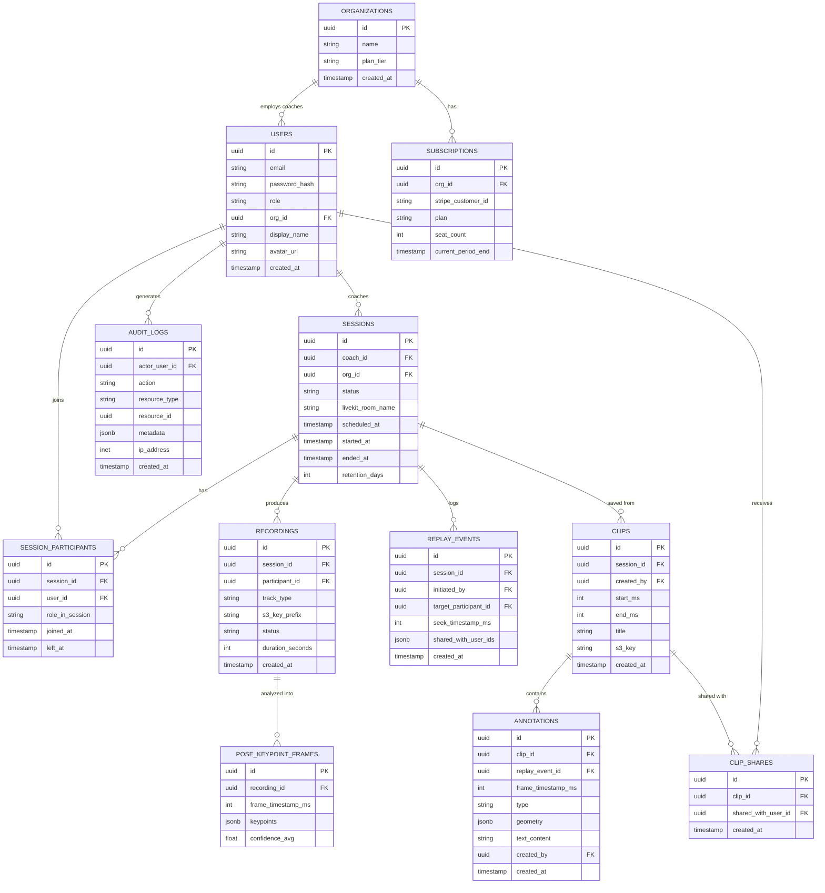

# 05 — Database Design

## 1. ERD Overview

## 2. Table Notes

### `users`
- `role`: enum `coach | student | studio_admin | platform_admin`.
- `password_hash`: bcrypt/argon2 — never store plaintext (see `16_Security_Guidelines.md`).
- `org_id` nullable — students and independent coaches may not belong to an org (Assumption A1).

### `sessions`
- `status`: enum `scheduled | live | ended | processed | archived`.
- `livekit_room_name`: unique identifier used to correlate with the LiveKit media layer.
- `retention_days`: per-session override of org default retention (Assumption A7).

### `recordings`
- One row per participant per track (video/audio) per session — enables independent per-student replay/pose analysis (supports FR-5.1 targeting).
- `s3_key_prefix`: points to the HLS-style segment folder in S3, not a single file, since Egress writes rolling segments during a live session.
- `status`: enum `recording | finalizing | ready | failed`.

### `pose_keypoint_frames`
- Stores keypoints at a throttled interval (e.g., every 100–150ms, not every raw video frame) to bound storage/DB write volume — see `09_Pose_Detection_Service.md` §4.
- `keypoints` JSONB shape: `{ "nose": [x,y,score], "left_shoulder": [x,y,score], ... }` (COCO 17-keypoint format).
- Indexed on `(recording_id, frame_timestamp_ms)` for fast seek-time lookup.

### `replay_events`
- Audit + functional record of every replay action — who triggered it, which student's footage, what timestamp, who it was broadcast to (FR-5.2). Doubles as an analytics source ("which moves get replayed most").

### `annotations`
- `geometry` JSONB shape varies by `type` (`freehand | arrow | circle | rectangle | text`), e.g. arrow: `{"from":[x,y],"to":[x,y]}`.
- Anchored by `frame_timestamp_ms`, not raw pixel-only coordinates, satisfying FR-7.2 (annotations track the video content, not the viewport).

### `clips`
- A clip is a **materialized, permanently saved** replay range + its annotations, distinct from the ephemeral in-session `replay_events`.

## 3. Indexing Strategy

| Table | Index | Purpose |
|---|---|---|
| `sessions` | `(coach_id, status)` | Coach dashboard "my live/upcoming sessions" |
| `session_participants` | `(session_id, user_id)` unique | Prevent duplicate joins, fast membership check |
| `recordings` | `(session_id, participant_id)` | Fast per-student recording lookup during replay |
| `pose_keypoint_frames` | `(recording_id, frame_timestamp_ms)` | Seek-time keypoint retrieval |
| `clips` | `(session_id)`, `(created_by)` | History browsing |
| `audit_logs` | `(actor_user_id, created_at)`, `(resource_type, resource_id)` | Security investigation queries |

## 4. Read/Write Separation

- Writes (session state, joins, annotations) go to the primary.
- Session-history, reporting, and admin dashboard queries are routed to a read replica to avoid contending with live-session write traffic (see `03_System_Architecture.md` §6).

## 5. Data Retention & Deletion

- Scheduled job purges `recordings` past `retention_days` (moves to Glacier first per `14_File_Storage_Media_Pipeline.md`, then deletes DB rows referencing purged S3 objects after the archive window).
- Account deletion cascades: user's owned sessions' recordings scheduled for deletion, `pose_keypoint_frames` deleted, `audit_logs` retained in anonymized form for compliance (actor reference nulled, action retained) — balances GDPR "right to erasure" with security audit integrity.
