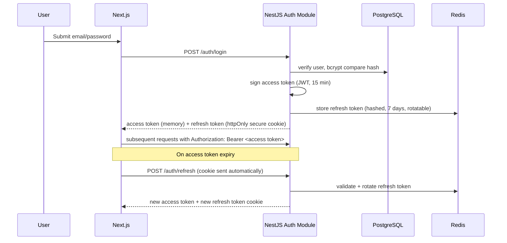

# 06 — Authentication, Authorization & RBAC

## 1. Authentication Flow



## 2. Token Design

| Token | Storage | Lifetime | Notes |
|---|---|---|---|
| Access Token (JWT) | In-memory (JS variable), never localStorage | 15 minutes | Short-lived to limit XSS blast radius; contains `sub`, `role`, `orgId`, `sessionVersion` |
| Refresh Token | httpOnly, Secure, SameSite=Strict cookie | 7 days, rotated on every use | Stored server-side (hashed) in Redis so it can be revoked instantly; rotation detects reuse (theft) and revokes the whole family |
| LiveKit Join Token | Short-lived, scoped to one room + one identity | Session duration | Issued by API after verifying the user is an authorized participant of that session (see §4) |

**Why not store JWT in localStorage:** localStorage is readable by any JS on the page, making it vulnerable to XSS token theft. Keeping the access token in memory + refresh token in an httpOnly cookie is the standard mitigation (see `16_Security_Guidelines.md` §XSS).

## 3. Password & Account Security

- Passwords hashed with **argon2id** (preferred) or bcrypt (cost factor ≥ 12) — never reversible encryption.
- Rate-limited login attempts (see `16_Security_Guidelines.md` §Rate Limiting) — exponential backoff + temporary lockout after repeated failures.
- Email verification required before a Coach can create sessions (reduces spam/abuse).
- Optional TOTP-based 2FA for Coach/Admin roles (recommended default-on for `studio_admin`/`platform_admin`).
- Password reset via time-limited, single-use signed token sent by email; never reveal whether an email exists (prevents user enumeration).

## 4. Authorization Model (RBAC)

| Role | Scope | Key permissions |
|---|---|---|
| `platform_admin` | Global | Full system access, support tooling, cannot bypass audit logging |
| `studio_admin` | One organization | Manage coaches within org, view org-wide session metadata (not raw recordings unless also a session participant) |
| `coach` | Own sessions | Create/manage sessions, control recording/replay/annotation, view own session history, manage own students' clip shares |
| `student` | Sessions they're invited to | Join sessions, view replays/clips shared with them, view own session history only |

### Resource-Level Authorization (beyond role)

Role alone isn't sufficient — every session/recording/clip access must also check **relationship to the resource**:

```
canAccessSession(user, session) =
    user.role == platform_admin
    OR session.coach_id == user.id
    OR user.id IN session.participants
    OR (user.role == studio_admin AND session.org_id == user.org_id AND metadata_only_access)
```

This check lives in a shared `PoliciesGuard` (NestJS guard + CASL or hand-rolled policy functions) applied at the controller level for every sessions/recordings/clips/annotations endpoint — never trust a resource ID in a request without this check (prevents IDOR — Insecure Direct Object Reference).

## 5. LiveKit Join Token Authorization

Critical control point: **the API — never the client — decides what a LiveKit token grants.**

1. Client requests to join session `X`.
2. API verifies via §4 policy that the user is an authorized participant of session `X`.
3. API mints a LiveKit access token scoped to: that specific room name, that participant identity, and permission flags (`canPublish`, `canSubscribe`) appropriate to their role (e.g., a removed/kicked participant's token is never reissued).
4. Token has a short TTL and is single-room-scoped — it cannot be reused to join a different session.

This prevents a student from ever obtaining a token that lets them join a session they weren't invited to, or impersonate the coach's control permissions (e.g., triggering replay-targeting, which is coach-only — enforced both in the WebSocket gateway auth and the REST layer).

## 6. Session/Replay-Specific Authorization Rules

| Action | Who can perform it |
|---|---|
| Start/stop recording | Coach only (automatic on session start per FR-4.1, but manual override reserved for coach) |
| Trigger replay seek | Coach only |
| Choose replay targets (FR-5.2) | Coach only |
| Draw annotations | Coach only (v1) — students are viewers, not annotators |
| View own past sessions | The student/coach who participated |
| View/download raw recordings | Coach (owner) + platform_admin (support, fully audited) — students can view **shared clips**, not raw full-session recordings, unless explicitly shared |
| Delete a session's recordings | Coach (owner) or platform_admin, both actions audit-logged |

## 7. Session Security

- Access tokens carry a `sessionVersion` claim; changing password or an admin-forced logout increments this, instantly invalidating all previously issued access tokens on their next validation.
- Refresh token reuse detection: if a rotated-out refresh token is presented again, the entire token family is revoked and the user is forced to re-authenticate (signals possible token theft).
- All auth endpoints served over HTTPS only; HSTS enabled at the load balancer.

## 8. Common Pitfalls to Avoid

- ❌ Trusting `role` claims in the JWT for resource-level decisions without also checking resource ownership/membership (IDOR risk).
- ❌ Issuing long-lived LiveKit tokens reusable across rooms.
- ❌ Allowing students to call replay/annotation endpoints directly (must be coach-gated even if a student's client is compromised/modified).
- ❌ Storing refresh tokens only client-side with no server-side revocation list.

## 9. Acceptance Criteria

- [ ] Access tokens expire in ≤15 min and are never persisted to localStorage/sessionStorage.
- [ ] Refresh token rotation + reuse detection implemented and tested.
- [ ] Every sessions/recordings/clips/annotations endpoint has an explicit resource-level authorization check, verified by an automated test per endpoint (see `18_Testing_Strategy.md`).
- [ ] LiveKit tokens are single-room-scoped and minted only after policy checks pass.
- [ ] Replay-trigger and annotation-draw actions are rejected server-side (WebSocket + REST) for non-coach roles even if attempted directly.
