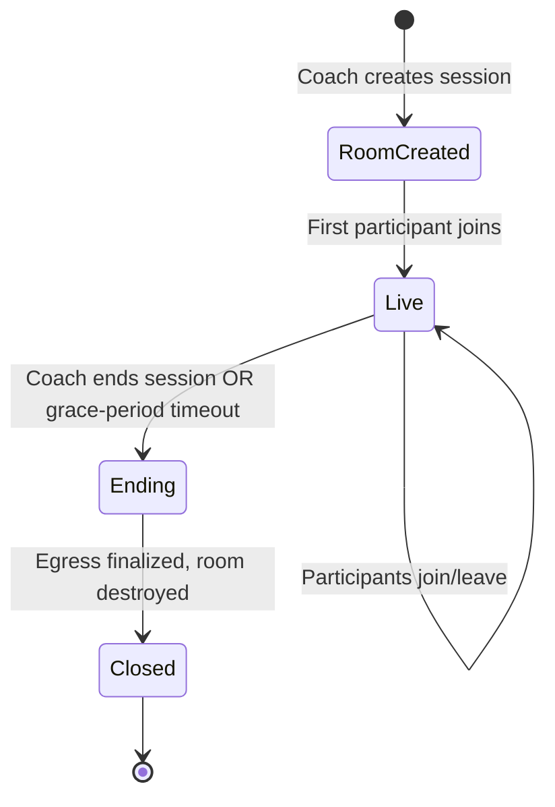

# 07 — LiveKit Video Architecture

## 1. Purpose

Provide the live audio/video call substrate for group coaching sessions, with server-side access to individual participant tracks — required for both continuous recording (`08_Recording_Replay_DVR_System.md`) and pose inference (`09_Pose_Detection_Service.md`). This is a custom-built video room, not a Zoom integration (see `00_Project_Overview.md` §6).

## 2. Deployment Options

| Option | When to use |
|---|---|
| **LiveKit Cloud** (managed) | Recommended for launch — removes SFU ops burden, usage-based pricing, fastest time-to-market |
| **Self-hosted LiveKit on AWS (ECS/EC2)** | Migration path once scale/cost justifies operating it in-house (Assumption A2 — revisit once concurrent-session numbers are confirmed) |

Design the integration (`LiveKitService` abstraction in the backend) so switching between Cloud and self-hosted is a configuration change, not a code rewrite — never hardcode LiveKit Cloud-specific assumptions into business logic.

## 3. Room Lifecycle

- Room is created via LiveKit Server SDK when the session status moves `scheduled → live` (or immediately for instant sessions).
- Room name = `session_{sessionId}` for deterministic lookups.
- Empty-room timeout configured so an abandoned room auto-closes (cost control) — but the *session* record only transitions to `ended` when the coach explicitly ends it, or the grace-period timeout (FR-2.6) elapses without the coach rejoining.

## 4. Participant & Track Model

- Each participant publishes one video track + one audio track (simulcast enabled for adaptive quality — NFR performance targets).
- Server subscribes to **every participant's video track** for two downstream consumers:
  1. **Egress** (recording) — see `08_Recording_Replay_DVR_System.md`
  2. **Pose Detection Service** — see `09_Pose_Detection_Service.md`
- Coach's client additionally has elevated LiveKit room permissions (`roomAdmin`-equivalent scoped actions) to mute/remove participants (FR-2.5) and pin/spotlight (FR-3.2).

## 5. Layouts

| Layout | Description |
|---|---|
| Gallery | Default grid of all participants |
| Coach-focus | Coach's video prioritized/larger, students in a sidebar strip |
| Spotlight | Coach pins one student full-screen (e.g., while they perform a move) |
| Replay overlay | Full-screen replay panel rendered *on top of*, not replacing, the underlying live call state — live tracks keep flowing to non-targeted students in the background |

## 6. Network Resilience

- WebRTC simulcast: each client publishes multiple quality layers; LiveKit's SFU forwards the appropriate layer per subscriber based on their bandwidth — critical for coaching scenarios where a student may be on a weaker home network.
- Reconnect handling: LiveKit client SDK's automatic reconnection (ICE restart) is used; the frontend shows a "reconnecting…" state rather than ejecting the participant from the room's application state (aligns with NFR §5 graceful reconnect).

## 7. Security Considerations

- Room join is only possible with a server-minted, single-room-scoped token (see `06_Authentication_Authorization_RBAC.md` §5) — LiveKit API keys/secrets never exposed to the client.
- Screen share (FR-3.4) restricted to coach role at the LiveKit grant level, not just hidden in the UI (defense in depth — a modified client must still be rejected server-side).
- All media encrypted via DTLS-SRTP (WebRTC default) end-to-end to the SFU; recordings at rest encrypted separately (`14_File_Storage_Media_Pipeline.md`).

## 8. Performance Considerations

- Target glass-to-glass latency < 500ms (NFR §1) — achievable with LiveKit's default WebRTC transport; avoid introducing unnecessary server-side relays for the *live* path (pose inference and Egress subscribe to tracks but do not sit in the critical path between publishing and subscribing participants).
- Cap default group session size (FR non-functional consideration) to protect per-client CPU/bandwidth (e.g., soft cap at 12 visible video tiles, consistent with NFR §2 launch target); pagination/"show more" for larger classes.

## 9. Common Pitfalls

- ❌ Treating LiveKit purely as "a Zoom replacement" and skipping server-side track subscription — the entire recording/pose/targeted-replay feature set depends on the backend having first-class access to raw tracks, which is exactly what off-the-shelf Zoom does not offer.
- ❌ Hardcoding room permissions in the frontend only, without server-side LiveKit grant enforcement.
- ❌ Not planning for the empty-room auto-close vs. explicit session-end distinction — leads to either orphaned billable rooms or premature session termination.

## 10. Acceptance Criteria

- [ ] Coach and students can join/leave a room reliably with < 500ms glass-to-glass latency under normal network conditions.
- [ ] Server subscribes to all participant tracks (verified via LiveKit server SDK track-subscribed callbacks).
- [ ] Coach-only actions (mute/remove/pin/screen-share) are rejected server-side when attempted by a student token.
- [ ] Simulcast verified functional under throttled-network testing.
- [ ] Room lifecycle transitions correctly logged to `sessions.status` and `audit_logs`.
