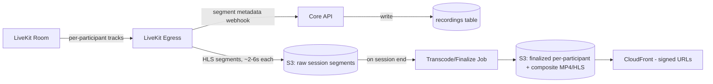
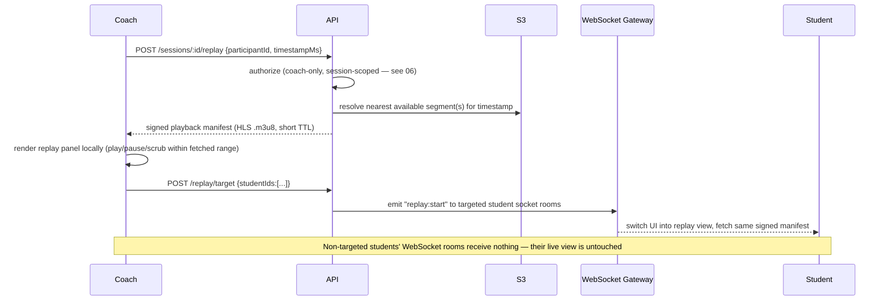

# 08 — Recording & Replay (Full-Session DVR) System

This is the most important and most technically distinctive module in the platform. It implements the confirmed requirement: **the coach can seek to any point in the current live session, not just the last few seconds.**

## 1. Why "Full-Session DVR" Is a Different System Than a Rolling Buffer

| | Rolling Buffer (rejected model) | Full-Session DVR (confirmed model) |
|---|---|---|
| What's stored | Last N seconds only, in memory | Entire session, continuously, to durable storage |
| Storage | In-process circular buffer | S3, via segmented recording |
| Seek range | Only "just now" | Anywhere from session start to current live point |
| Failure mode | Data older than N seconds is unrecoverable by design | A storage/upload failure is a real incident to detect and alert on |
| Cost profile | Near-zero storage cost | Storage cost scales with session length × participants — must be actively managed (retention policy) |

The system is built entirely around the DVR model. There is no in-memory-only buffer anywhere in this design.

## 2. Recording Pipeline

- **LiveKit Egress** runs two parallel jobs per session:
  1. **Track Egress** — one per participant's video, needed for (a) per-student targeted replay and (b) per-student pose inference alignment.
  2. **Room Composite Egress** — a single mixed view, used for full-session download/export and coach's own post-class review.
- Segments are written to S3 continuously (every few seconds) **during** the live session — this is what makes "seek to any earlier point while still live" possible without waiting for the session to end.
- A webhook from Egress notifies the API of each finalized segment, which updates the `recordings` row's manifest so the seek API always knows what's currently seekable.

## 3. Seek/Replay Request Flow (Live, Mid-Session)

- Because segments are only 2–6 seconds each, "seek to timestamp T" resolves to "fetch the segment containing T" — this is what keeps seek latency under the 3s NFR target (FR-4.4) instead of requiring a full re-transcode on demand.
- Signed CloudFront URLs (short TTL, tied to the requesting user's session) prevent recording URLs from being freely shareable outside the platform (see `16_Security_Guidelines.md` §Replay Authorization).

## 4. Targeted Replay (FR-5.2) — Implementation Note

Replay is **not a global session-wide state change**. It is modeled as a per-viewer UI mode switch, driven by WebSocket room targeting:

- Each student has their own WebSocket room channel: `session:{id}:participant:{userId}`.
- `replay:start` events are emitted only to the specifically targeted channels.
- Non-targeted students' clients never receive the event and continue rendering the live LiveKit tracks uninterrupted — this satisfies FR-5.3 without needing any server-side "pause" of the live call itself.
- The coach's own client always has a persistent "return to live" control, independent of what any given student is currently viewing.

## 5. Post-Session Processing

Once a session ends:

1. Egress jobs are stopped and finalized.
2. A background job stitches/validates the segment manifest into a durable, browsable recording (per participant + composite).
3. If any pose-keypoint backfill is needed (e.g., a portion wasn't processed live due to a transient AI service outage — NFR §5), it's queued here.
4. Session status moves `ended → processed` once recordings + pose data are confirmed complete, then becomes visible in session history (FR-8.1).

## 6. Clips vs. Raw Recordings

- A **Clip** (FR-5.5) is a *materialized* excerpt: the relevant segment range is copied/re-packaged into its own S3 object with any annotations baked into associated metadata (not burned into pixels, so they remain editable/toggleable on replay).
- Raw full-session recordings remain the coach's private property by default; Clips are the unit that gets explicitly shared with students (`clip_shares` table) — this distinction keeps students from having blanket access to an entire class recording (including other students) by default.

## 7. Security Considerations

- Every replay/seek request is authorized against session participation (§ see `06_Authentication_Authorization_RBAC.md` §6) — this is the "Replay Authorization" control called out as a first-class security requirement.
- Signed URLs are short-TTL and single-use-oriented (CloudFront signed URLs with tight expiry), preventing link-sharing outside the platform.
- Per-participant track separation means a student replay-targeted to "their own" footage cannot access another student's raw track by manipulating the request — enforced server-side by checking `targetParticipantId` against the actual `recordings.participant_id`, never trusting a client-supplied S3 key directly.

## 8. Performance Considerations

- Segment length (2–6s) is the key tuning knob: shorter segments improve seek granularity/latency but increase Egress/S3 request overhead — start at 4s and tune based on real seek-latency measurements (`20_Performance_Optimization.md`).
- Composite Egress and per-track Egress run independently so a slow composite mux never blocks the low-latency per-track path used for actual replay seeking.

## 9. Future Scalability

- Segment manifests are designed so a future "instant highlight reel" feature (auto-suggested best clips) can be layered on without re-architecting the recording pipeline.
- Multi-region S3/CloudFront can be introduced later for geographically distributed studios without changing the API contract (signed URL issuance stays server-side).

## 10. Common Pitfalls

- ❌ Building this as "record only when replay is pressed" — breaks the confirmed full-session-seek requirement entirely.
- ❌ Storing only a composite mixed recording — makes true per-student targeted replay (FR-5.1/5.2) and per-student pose inference impossible; per-track Egress is mandatory.
- ❌ Long-lived or unsigned S3 URLs for recordings.
- ❌ Treating "replay" as a server-side global session state — it must be per-viewer targeted (§4), not a broadcast-to-everyone pause.

## 11. Acceptance Criteria

- [ ] Recording starts automatically at session start (FR-4.1), continuously, for every participant track.
- [ ] Coach can seek to any earlier timestamp in the live session with < 3s latency (FR-4.4).
- [ ] Only coach-selected students receive the replay view; others remain on live video (FR-5.2/5.3).
- [ ] Full recordings and per-clip exports are available in session history after the session ends (FR-4.5, FR-8.1).
- [ ] A simulated Egress/S3 failure mid-session does not interrupt the live call, and is surfaced as a non-blocking warning (NFR §5).
