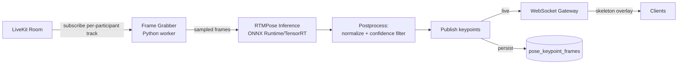

# 09 — Pose Detection Service

## 1. Purpose & Boundaries

Detect body keypoints (skeleton) for visible participants, in near-real-time on the live feed and retrospectively for recorded footage. **The AI does exactly this and nothing else** — no scoring, no judgment, no feedback generation (per explicit client requirement in discovery). This boundary must be enforced architecturally, not just by convention: the service's output contract is strictly `{keypoints, confidence}`, with no fields for "quality," "correctness," or "score."

## 2. Model Selection

See `04_Tech_Stack.md` §3 for the full comparison. **RTMPose selected as primary**, YOLO-Pose as documented fallback. MediaPipe explicitly excluded per client direction (production-grade requirement).

## 3. Architecture

- Deployed as an independent service (separate from the core API), consuming LiveKit tracks via the LiveKit server SDK's media subscription in Python.
- Runs as a **pool of workers** behind a queue (SQS or Redis Streams): each active session's track is assigned to a worker; queue depth drives auto-scaling (see `03_System_Architecture.md` §6).

## 4. Sampling & Throttling Strategy

Running full-framerate (30fps) inference per participant is unnecessary and expensive. Design:

- Sample at **~8–10 inferences/second per participant** — enough for smooth-looking skeleton overlay on human movement, far cheaper than 30fps.
- Persist to `pose_keypoint_frames` at the same throttled rate (bounds DB write volume — see `05_Database_Design.md`).
- For **replay**, keypoints are read from storage at the exact segment being viewed rather than re-run live, so scrubbing doesn't trigger new inference load.
- If a session is replayed for a time range where keypoints weren't yet computed (e.g., the AI service briefly degraded per NFR §5), a backfill job computes them from the stored recording asynchronously rather than blocking playback — playback proceeds without skeleton until backfill completes, then it appears on next view.

## 5. Cost Model & Toggling

Pose inference (especially GPU-backed) is the largest variable cost in the system (NFR §9). Controls:

- Pose overlay can be **enabled/disabled per session or per org tier** — if a coach doesn't need it for a given class, no inference cost is incurred.
- Auto-scaling worker pool means idle capacity (nights/off-peak) scales toward zero, not a fixed always-on GPU fleet.
- Fallback to a lighter model (YOLO-Pose, or even MoveNet for single-participant sessions) can be configured per org as a cost/accuracy tradeoff — abstracted behind a common `PoseModelAdapter` interface so swapping models doesn't touch calling code.

## 6. Multi-Person Handling

Group sessions (FR-2.2) require correctly attributing keypoints to the right participant:

- Since inference runs **per LiveKit track** (i.e., per participant's own video feed), there is no cross-participant identity-matching problem — each worker only ever sees one person's video, sidestepping the classic "multi-person pose matching" difficulty entirely. This is a direct benefit of per-track (not single composite-frame) inference.

## 7. Failure Isolation (Critical — NFR §5, FR-6.4)

- The pose service is a **subscriber**, never a dependency in the live video or recording critical path. If it crashes or lags:
  - Live video: unaffected (LiveKit continues independently).
  - Recording: unaffected (Egress is a separate LiveKit subscriber).
  - Only the skeleton overlay disappears client-side (graceful — the frontend simply stops receiving `pose:update` WebSocket events and hides the overlay layer).
- Circuit breaker: WebSocket gateway stops attempting to forward pose events for a track after repeated timeouts, avoiding cascading backpressure.

## 8. Security Considerations

- Pose keypoint data is treated as sensitive/biometric-adjacent by default (Assumption A5) — same access controls as the underlying recording (a user who can't view a recording can't query its keypoints either).
- No pose data is used for any purpose beyond overlay rendering in v1 (no biometric identification/matching use case) — explicitly documented to keep future privacy/legal review scoped correctly.

## 9. Performance Considerations

- Target: skeleton overlay lags live video by < 200ms (NFR §1) — achievable at the 8–10fps sampling rate with GPU inference; CPU-only fallback should be benchmarked and may need a lower sampling rate or accept higher latency as a documented tradeoff.
- Batch inference where possible (multiple frames per GPU call) to improve throughput per worker without hurting the perceived overlay smoothness.

## 10. Future Scalability

- The `PoseModelAdapter` abstraction (§5) is what allows introducing a v2 "form analysis" feature later (e.g., angle calculations between joints) without re-architecting the ingestion pipeline — new logic would consume the same keypoint stream, not replace it.

## 11. Common Pitfalls

- ❌ Running inference on the composite/mixed video feed instead of per-participant tracks — reintroduces the multi-person identity-matching problem this architecture is designed to avoid.
- ❌ Persisting every single inferred frame at full framerate — unnecessary storage/DB load.
- ❌ Letting pose service latency/failure block or delay the live video pipeline in any way.
- ❌ Silently expanding scope into "form scoring" — explicitly out of scope; flag any such request back to the product owner rather than implementing it inside this service.

## 12. Acceptance Criteria

- [ ] Skeleton overlay renders on live video within 200ms of the corresponding frame (NFR §1).
- [ ] Pose service outage does not affect live video/recording (verified via chaos test — kill the pose service mid-session).
- [ ] Group session with 6+ participants correctly attributes keypoints per-participant with zero cross-attribution errors (guaranteed structurally by per-track inference, verified by integration test).
- [ ] Replay of a segment shows the correct historical skeleton, sourced from stored keypoints, not re-inferred live.
- [ ] Pose data access is gated by the same authorization rules as the underlying recording.
