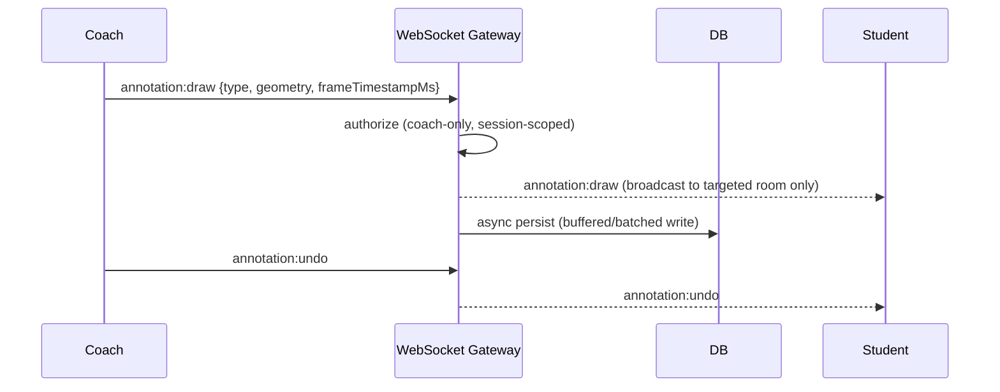

# 10 — Annotation System

## 1. Purpose

Let the coach draw on a paused replay frame (circles, arrows, freehand, text) to visually point out what verbal feedback alone can't communicate, and broadcast that drawing in real-time to the targeted student(s).

## 2. Coordinate Model — Frame-Anchored, Not Pixel-Anchored

The critical design decision (FR-7.2): annotations must be stored relative to the **video content's coordinate space** (normalized 0–1 x/y, tied to a specific `frame_timestamp_ms`), not the viewer's raw screen pixels.

```json
{
  "type": "circle",
  "frame_timestamp_ms": 15320,
  "geometry": { "cx": 0.42, "cy": 0.31, "r": 0.08 },
  "color": "#FF3B30",
  "created_by": "coach_uuid"
}
```

Rendering multiplies normalized coordinates by the *current* rendered video dimensions on each client — so a coach on a 1080p display and a student on a phone screen see the circle in the same relative spot on the subject's body, correctly scaled, regardless of window size or aspect handling.

## 3. Drawing Tools (FR-7.1)

| Tool | Geometry shape |
|---|---|
| Freehand | Array of normalized `[x,y]` points (simplified/smoothed client-side before send) |
| Arrow | `{from:[x,y], to:[x,y]}` |
| Circle/Ellipse | `{cx, cy, rx, ry}` |
| Rectangle | `{x, y, width, height}` |
| Text label | `{x, y, text, fontSize}` |

## 4. Real-Time Broadcast Flow



- Broadcast happens **before** DB persistence completes (optimistic, fire-and-forget to targeted clients) to hit the <150ms broadcast latency target (NFR §1) — persistence is for later Clip-saving (FR-5.5) and history, not a gate on real-time delivery.
- Only broadcast to the currently-targeted student room(s) from the active replay session (`08_Recording_Replay_DVR_System.md` §4) — same targeting mechanism, reused here rather than duplicated.

## 5. Undo/Redo/Clear (FR-7.3)

- Client maintains a local stroke history stack for instant undo/redo responsiveness.
- `annotation:clear` broadcasts a clear-all event for the current frame's annotation layer; server appends a "cleared" tombstone rather than physically deleting rows already persisted mid-broadcast, to avoid race conditions between a slow persist and a fast undo.

## 6. Saving as a Clip (FR-7.5)

When the coach saves the current replay range as a Clip:

1. Finalize/flush all pending annotation writes for that frame range.
2. Copy the relevant recording segment (per `08_Recording_Replay_DVR_System.md` §6) and link the annotation rows to the new `clip_id`.
3. Annotations remain toggleable metadata on replay (not burned into video pixels) — preserves editability and accessibility (e.g., text-to-speech for text labels, if ever needed).

## 7. Security Considerations

- Server-side enforcement that only the coach role can emit `annotation:draw/undo/clear` events for a session — checked in the WebSocket gateway's event handler, not just hidden in the UI (see `06_Authentication_Authorization_RBAC.md` §6).
- Annotation content is validated/sanitized server-side (geometry bounds clamped to [0,1], text length capped, no HTML/script injection risk since text is rendered via a canvas/SVG text node, never `innerHTML`).

## 8. Performance Considerations

- Freehand strokes are simplified (e.g., Douglas-Peucker point reduction) client-side before transmission to avoid flooding the WebSocket channel with excessive point data.
- Batch annotation persistence writes (debounced, e.g., every 500ms or on stroke-end) rather than one DB write per point.

## 9. Future Scalability

- The frame-anchored model (§2) is what would allow a future "student can also annotate their own review notes" feature without redesigning storage — just relaxing the coach-only restriction in §7 for a new permission tier.

## 10. Common Pitfalls

- ❌ Storing annotations in raw screen pixels — breaks the moment two viewers have different window sizes.
- ❌ Trusting client-side role checks alone for who can draw.
- ❌ Blocking real-time broadcast on synchronous DB writes (kills the <150ms latency target).
- ❌ Burning annotations into recorded video pixels — loses toggleability and makes correction/undo impossible after the fact.

## 11. Acceptance Criteria

- [ ] Annotations render at the same relative position on the subject regardless of viewer screen size (tested at multiple resolutions).
- [ ] Draw-to-visible-on-student latency < 150ms under normal network conditions (NFR §1).
- [ ] Non-coach roles are rejected server-side when attempting to emit annotation events.
- [ ] Undo/redo/clear work correctly even under concurrent slow-network conditions (no duplicate or ghost strokes).
- [ ] Saved Clips retain fully accurate, correctly time-anchored annotations on replay.
