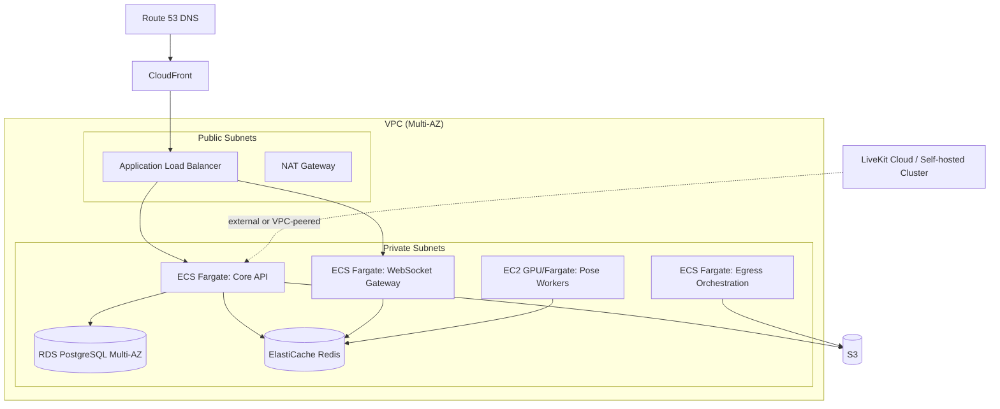

# 15 — AWS Infrastructure

## 1. Infrastructure Diagram

## 2. Compute

| Service | Runtime | Scaling |
|---|---|---|
| Core API | ECS Fargate | Target-tracking auto-scaling on CPU (target 60%) + request count per target |
| WebSocket Gateway | ECS Fargate | Scaling on concurrent connection count (custom CloudWatch metric) |
| Pose workers | EC2 (g4dn/g5 GPU) via ECS, or Fargate for CPU-only fallback | Queue-depth-driven auto-scaling (SQS `ApproximateNumberOfMessages`) |
| Egress orchestration | ECS Fargate | Scales with concurrent recording sessions |

## 3. Networking

- VPC with public subnets (ALB, NAT) and private subnets (all application/data services) across ≥2 AZs.
- Security groups scoped narrowly per service (e.g., RDS SG only accepts traffic from API/worker SGs, never `0.0.0.0/0`).
- LiveKit self-hosted (if chosen over Cloud) requires public UDP ports for WebRTC media — isolated in its own SG with tightly scoped rules, separate from the rest of the private application tier.

## 4. Data Layer

- RDS PostgreSQL, Multi-AZ, automated backups (point-in-time recovery enabled), read replica for reporting/history queries.
- ElastiCache Redis, cluster mode for the WebSocket Redis adapter's pub/sub + rate-limiting counters.

## 5. Infrastructure as Code

- **Terraform**, organized as reusable modules: `network/`, `ecs-service/`, `rds/`, `elasticache/`, `s3/`, `cloudfront/`, `iam/`.
- Environments (`dev`, `staging`, `prod`) as separate Terraform workspaces/state files sharing the same modules — no manual console changes permitted in `prod` (NFR §6).
- Secrets (DB credentials, LiveKit API keys, KMS-related config) stored in **AWS Secrets Manager**, referenced by ECS task definitions via `secrets` block — never baked into images or Terraform variable files in plaintext.

## 6. IAM Strategy

- Principle of least privilege: each ECS task has its own scoped IAM role (e.g., Egress task role can only write to the raw recordings bucket, nothing else).
- No shared "god role" across services.
- Human access via IAM Identity Center (SSO) with role assumption, MFA enforced; no long-lived IAM user access keys for engineers.

## 7. Environments

| Environment | Purpose | Notes |
|---|---|---|
| `dev` | Feature development, AI-agent-driven module builds | Smaller instance sizes, shared LiveKit dev project |
| `staging` | Pre-prod validation, load testing | Mirrors prod topology at smaller scale |
| `prod` | Live traffic | Full Multi-AZ, auto-scaling, monitoring/alerting active |

## 8. Security Considerations

- WAF (AWS WAF) attached to the ALB/CloudFront distribution — rate-based rules, common attack pattern rule sets (OWASP core rule set equivalent).
- All inter-service traffic inside the VPC over private subnets; only ALB/CloudFront/NAT touch the public internet directly.
- GuardDuty enabled for threat detection across the account.

## 9. Cost Considerations

- GPU pose workers are the primary cost-scaling risk — queue-depth auto-scaling with a sensible minimum (scale near-to-zero off-peak) is essential (ties back to `09_Pose_Detection_Service.md` §5).
- S3 lifecycle policies (`14_File_Storage_Media_Pipeline.md`) directly control storage cost growth.
- Consider LiveKit Cloud's usage-based pricing vs. self-hosted EC2 SFU cost crossover point once real usage data exists (Assumption A2 — revisit).

## 10. Common Pitfalls

- ❌ Manual console changes to `prod` infra — causes Terraform state drift.
- ❌ Overly broad security groups (`0.0.0.0/0`) "to make it work" during development, left in place for prod.
- ❌ Long-lived static AWS credentials anywhere in application code or CI.

## 11. Acceptance Criteria

- [ ] All infrastructure reproducible from Terraform in a fresh AWS account (verified in staging).
- [ ] No plaintext secrets in code, images, or Terraform state committed to version control (state stored in encrypted S3 backend with locking via DynamoDB).
- [ ] IAM roles pass a least-privilege review (no wildcard `*` resource/action grants without documented justification).
- [ ] WAF and GuardDuty active in prod before go-live.
