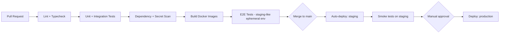

# 19 — CI/CD & Deployment

## 1. Pipeline Overview (GitHub Actions)

## 2. Environments & Promotion

- Every PR triggers lint/test/build; merge to `main` auto-deploys to `staging`.
- Production deployment requires manual approval gate (GitHub Environments protection rule) after staging smoke tests pass.
- Each of the four independently deployable services (Core API, WebSocket Gateway, Pose Service, Egress orchestration) has its own pipeline stage/Docker image, deployable independently — a Pose Service change doesn't require redeploying the Core API (`03` §1).

## 3. Deployment Strategy

- **Blue/green or rolling deployment** on ECS Fargate services (rolling with health-check-gated task replacement as the default; blue/green for higher-risk releases like auth changes).
- Database migrations run as a separate, explicit pipeline step **before** new application code deploys (backward-compatible migrations only — never a breaking schema change deployed simultaneously with the code that depends on it; use expand/contract pattern for breaking changes).
- Feature flags (e.g., a simple LaunchDarkly-equivalent or homegrown flag table) for risky features like enabling pose detection for a new org tier, allowing instant rollback without a redeploy.

## 4. Rollback Strategy

- ECS task definition revisions retained; rollback = redeploy previous task definition revision (fast, automatic on failed health checks).
- Database migrations designed to be forward-compatible for at least one release (old code can run against new schema) so a code rollback never requires an emergency migration rollback.

## 5. Build & Artifact Management

- Docker images built once per commit, tagged with commit SHA, pushed to Amazon ECR, promoted (not rebuilt) from staging to prod — guarantees the exact tested artifact reaches production.
- Multi-stage Dockerfiles (build stage separate from runtime stage) to keep production images minimal and reduce attack surface.

## 6. Infrastructure Deployment

- Terraform changes go through their own PR review + `terraform plan` output posted as a PR comment; `terraform apply` gated behind manual approval for `staging`/`prod` workspaces (see `15_AWS_Infrastructure.md` §5).

## 7. Security Considerations

- Dependency vulnerability scanning (Dependabot/`npm audit`/`pip-audit`) and secret scanning (e.g., Gitleaks) block the pipeline on critical findings.
- Least-privilege CI/CD IAM role (OIDC federation from GitHub Actions to AWS, no long-lived AWS access keys stored as GitHub secrets).

## 8. Common Pitfalls

- ❌ Deploying schema-breaking migrations at the same time as dependent code changes.
- ❌ Rebuilding images between staging and prod instead of promoting the exact tested artifact.
- ❌ Long-lived AWS credentials stored as GitHub Actions secrets instead of OIDC role assumption.

## 9. Acceptance Criteria

- [ ] Every service independently deployable without redeploying unrelated services.
- [ ] Rollback tested and confirmed to restore previous version within minutes.
- [ ] No deploy to prod without passing staging smoke tests and manual approval.
- [ ] CI/CD uses OIDC-based AWS auth, not static credentials.
