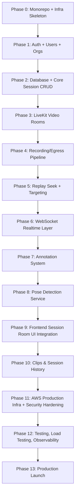

# 22 — Project Roadmap & AI Development Workflow

## 1. Build Order (Dependency-Driven)



**Why this order, and why it differs slightly from the generic template:** Recording (Phase 4) and Replay (Phase 5) are pulled *ahead* of Pose Detection (Phase 8) and Annotation (Phase 7), because they are the confirmed core differentiator (full-session DVR) and the riskiest, most architecturally load-bearing piece (`08_Recording_Replay_DVR_System.md` §1). Validating that recording/replay actually works end-to-end on real LiveKit tracks *before* building pose detection and annotation on top of it avoids discovering a fundamental Egress/seek problem late, after two more modules have been built assuming it works.

## 2. Phase Breakdown

### Phase 0 — Monorepo & Infra Skeleton
- Turborepo setup, shared `packages/types`, base Terraform (`network`, empty ECS clusters), CI skeleton (lint/test/build only, no deploy yet).

### Phase 1 — Auth, Users, Organizations
- Registration/login/refresh, RBAC roles, org/studio model (`06`, `05` §users/orgs tables).

### Phase 2 — Database & Core Session CRUD
- Full schema migration (`05`), session create/list/get endpoints (no video yet — just the data model and lifecycle states).

### Phase 3 — LiveKit Video Rooms
- Room provisioning, join-token minting, basic gallery UI, join/leave/reconnect (`07`, `13` VideoGrid).

### Phase 4 — Recording/Egress Pipeline
- Track + composite Egress wired to S3, segment webhook handling, `recordings` table population (`08` §2, `14`).

### Phase 5 — Replay Seek + Targeting
- Seek API, signed manifest generation, per-student targeting channels (`08` §3–4, `12` replay endpoints).

### Phase 6 — WebSocket Realtime Layer
- Socket gateway, channel model, auth handshake (`11`) — built once recording/replay have real events to carry.

### Phase 7 — Annotation System
- Drawing tools, frame-anchored coordinates, real-time broadcast (`10`).

### Phase 8 — Pose Detection Service
- RTMPose inference pipeline, per-track subscription, keypoint persistence, live overlay events (`09`).

### Phase 9 — Frontend Session Room Integration
- Full `session/[id]` route: VideoGrid + SkeletonOverlay + ReplayPanel + AnnotationCanvas + ReplayTargetPicker wired together (`13`).

### Phase 10 — Clips & Session History
- Save-as-clip, sharing, dashboards for coach/student history (`01` FR-8, `05` clips/clip_shares).

### Phase 11 — AWS Production Infra & Security Hardening
- Full Terraform for staging/prod, WAF/GuardDuty, secrets rotation, IAM review (`15`, `16`).

### Phase 12 — Testing, Load Testing, Observability
- Full test suite per `18`, dashboards/alerts per `17`, load test against NFR targets.

### Phase 13 — Production Launch
- `21_Production_Checklist.md` fully signed off.

## 3. AI-Agent Development Task Template

Every task handed to an AI coding tool (Antigravity, Cursor, Claude Code) follows this shape, regardless of phase:

```
### Task: <name>
Objective: <what this task accomplishes, one sentence>
Prerequisites: <which prior phases/tasks must already be complete>
Files involved: <exact paths to create/modify>
Expected output: <concrete description of the resulting behavior/artifact>
Acceptance criteria: <checklist, pulled from the relevant module's §Acceptance Criteria>
Testing checklist: <specific tests to write/run, pulled from 18_Testing_Strategy.md §2 where applicable>
```

## 4. Example Task Breakdown — Phase 5 (Replay Seek + Targeting)

| Task | Objective | Files | Acceptance criteria (from `08` §11) |
|---|---|---|---|
| 5.1 | Segment manifest storage | `recordings` table + webhook handler | Manifest metadata updates within 1s of Egress webhook |
| 5.2 | Seek resolution endpoint | `replay.controller.ts`, `replay.service.ts` | Correct segment resolved for arbitrary timestamp, <3s p95 |
| 5.3 | Signed URL issuance | `media/cloudfront-signer.ts` | URLs expire correctly, rejected after TTL |
| 5.4 | Replay targeting endpoint + WS fanout | `replay.controller.ts`, WS gateway hook | Only targeted students' sockets receive `replay:start` |
| 5.5 | Authorization tests | `replay.e2e-spec.ts` | Non-coach rejected; cross-participant access rejected |

This same decomposition pattern applies to every phase — see `23_Antigravity_Prompt_Library.md` for the actual ready-to-use prompts per task.

## 5. Milestone Demos (Recommended Checkpoints)

| After Phase | Demo |
|---|---|
| 3 | Two browser tabs join a LiveKit room and see each other live |
| 5 | Coach seeks to an earlier point in an active session and sees correct historical video |
| 8 | Skeleton renders live on a real webcam feed in a session |
| 9 | Full coach workflow: live → replay → target a student → annotate → return to live, end to end |
| 13 | Production go-live |
